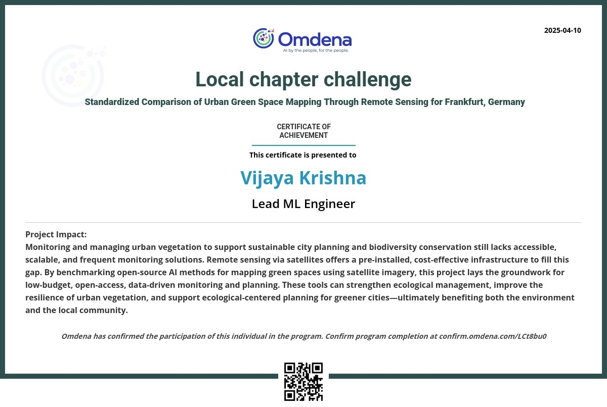
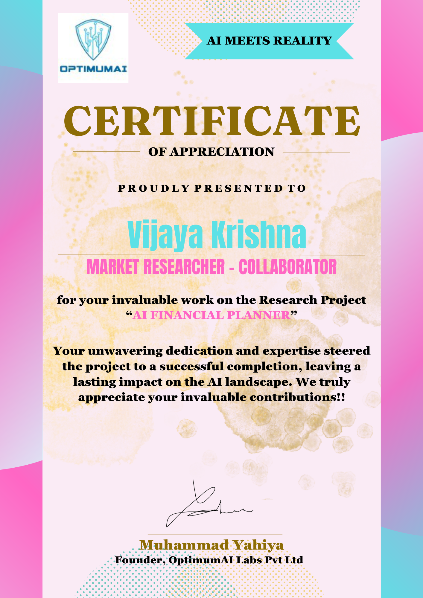
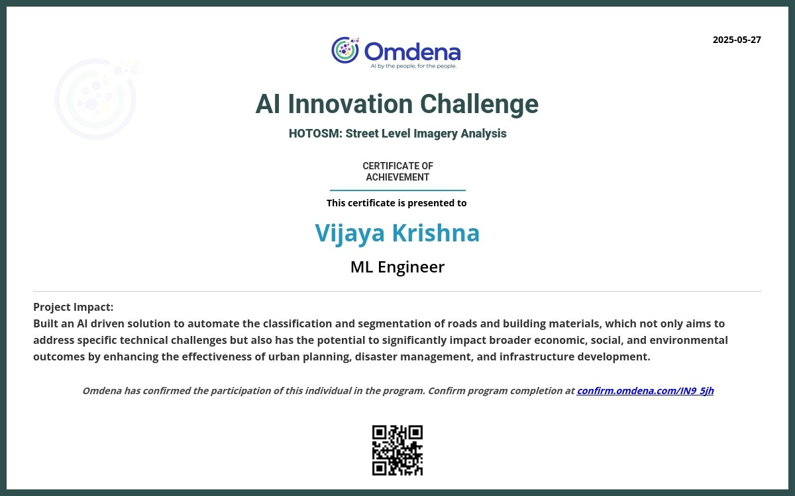
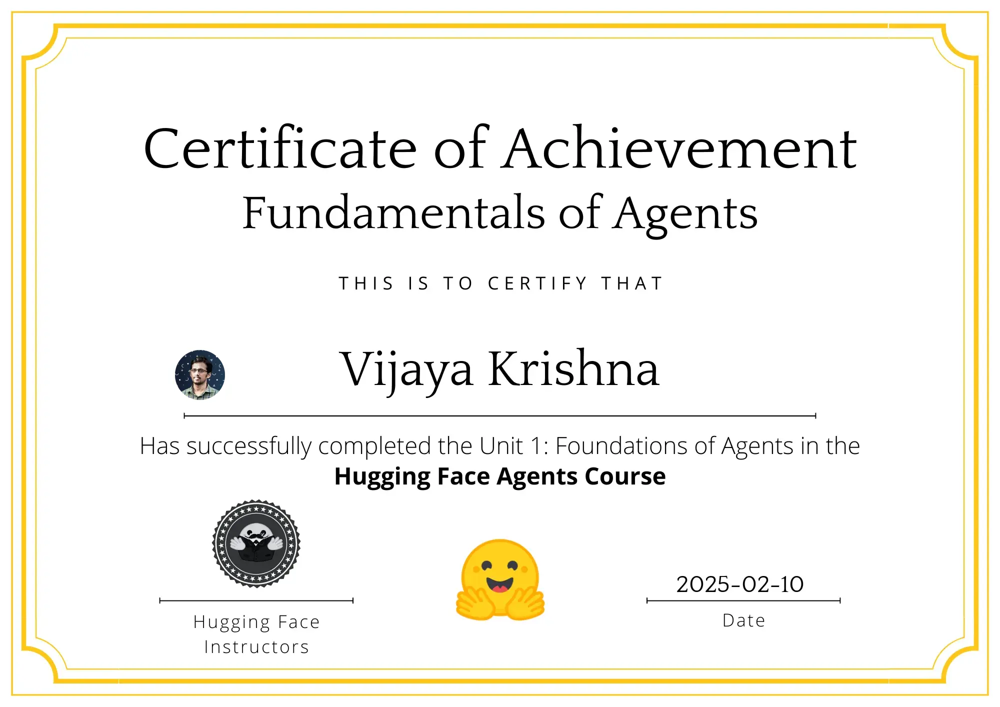
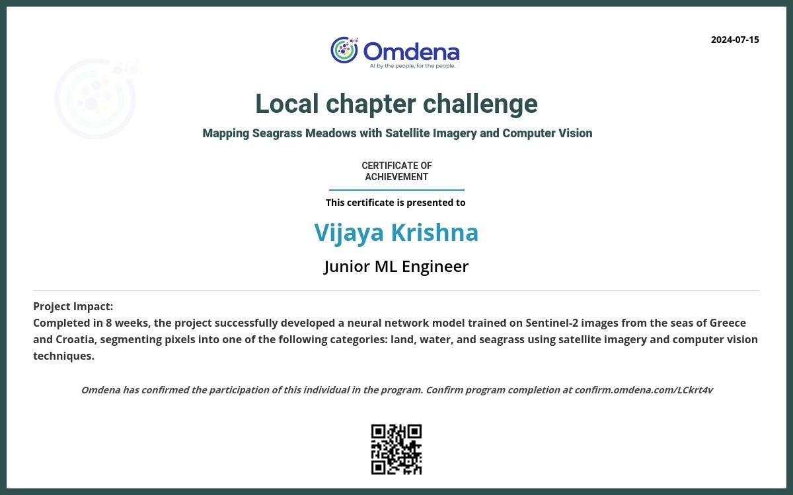
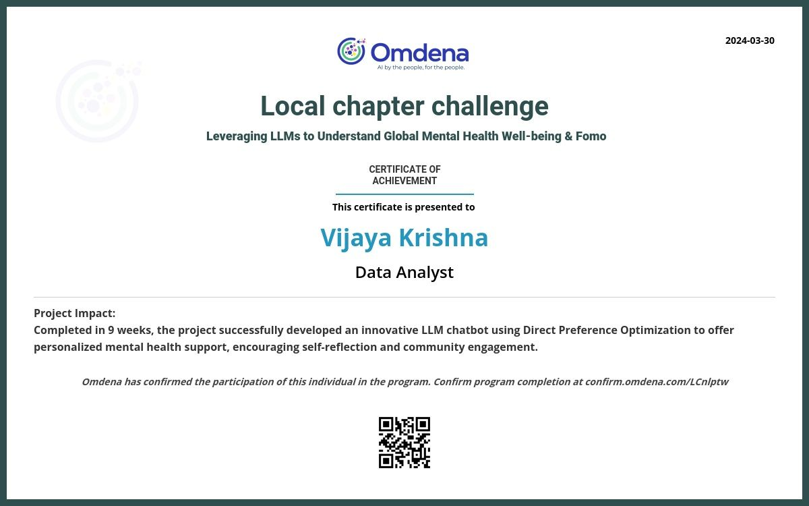
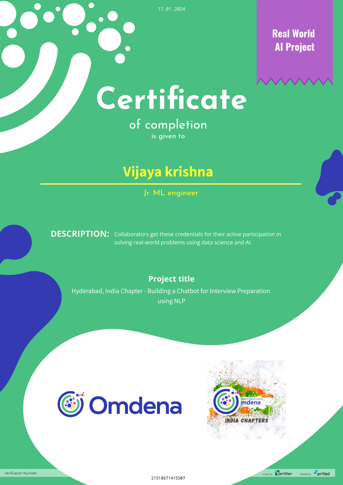
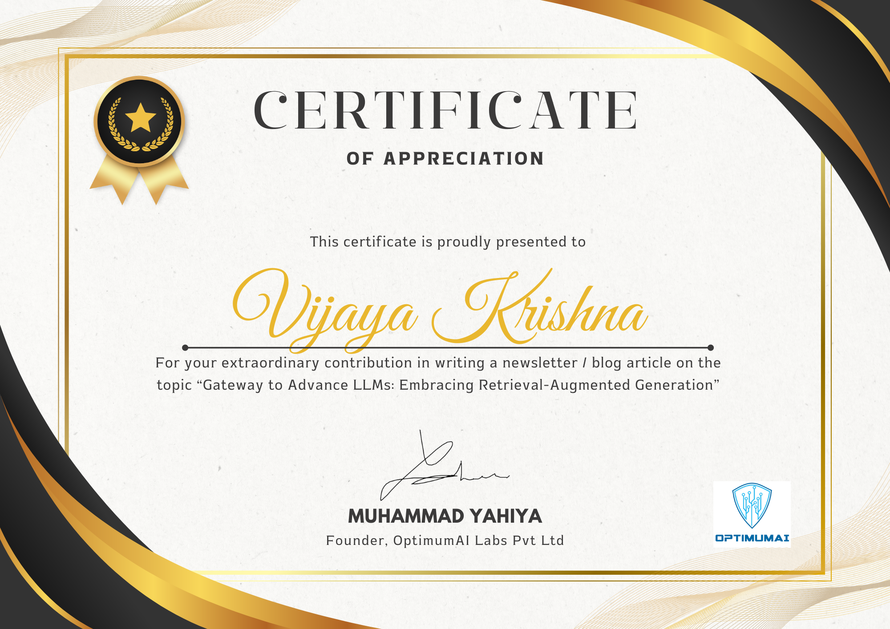

#  Vijaya Krishna

Dynamic professional innovating at the intersection of engineering and AI.

 +91 9611747756 | +91 9481194676  
 vijaykrishnavk92@gmail.com  
[LinkedIn](https://www.linkedin.com/in/vijaya-krishnak-139487297/) | GitHub: vijayakrishna92 | [Dagshub](https://dagshub.com/vijaykrishnavk92)  
 Konila House, Vorkady Post, Manjeshwara Village, Kasaragod-671323, Kerala, India

---

##  Objective

Detail-oriented and versatile professional with extensive experience in hardware engineering, software development, and AI projects. Skilled in system design, machine learning, cross-functional collaboration, and storytelling through code. Seeking to leverage my diverse background in a dynamic role focused on innovation, impact, and bridging human stories with technology.

---

##  Skills

- **AI & Data:** AI agents, Retrieval-Augmented Generation (RAG), prompt engineering, sentiment analysis, data preprocessing (NLTK), ML algorithms (Linear Regression, Polynomial Regression, XGBoost, Random Forest), fine-tuning.
- **Frameworks & Tools:** CrewAI, LangGraph, AutoGen, LlamaIndex.
- **Programming:** Python, Arduino.
- **Frontend & Backend:** React, Next.js, FastAPI, Redis, PostgreSQL, Flutter.
- **GIS & Remote Sensing:** Google Earth Engine, QGIS, Labelbox.
- **Design:** Canva (certificates, brochures).
- **Soft Skills:** Collaboration, mentorship, reporting, problem-solving.

---

##  Education

- **Master of Science in Electronics** – Mangalore University (2013–2015) – 63.36%
- **Bachelor of Science in Physics, Mathematics, Electronics** – Vivekananda College, Mangalore University (2010–2013) – 64.74%
- **Pre-University (PUC)** – Vivekananda PU College (2008–2010) – 53.5%
- **SSLC** – Vishwamangala High School (2008) – 72.96%

---

##  Work Experience

### Mechanical Engineer & Trainer – Sarasija Foods, Mangalore (2018–2024)
- Maintained, rebuilt, and optimized bakery machinery.
- Trained staff on operations and adjustments.
- Prototyped and rebuilt bread-packing machine.

>  *Reason for leaving*: Family health issues and pandemic delays; wanted to pivot to AI/tech full-time.

---

### Hardware Engineer & Trainer – Tecprosoft (2017–2018)
- Built academic hardware projects (dental vibrator, Siemens display unit reverse engineering).
- Trained students on Arduino basics and coding.
- Managed hardware inventory and procurement.

>  *Reason for leaving*: Low salary and very long hours; needed better work–life balance and growth.

---

### AI Researcher & Course Instructor – OptimumAI (2024)
- Conducted research for an AI financial planner chatbot.
- Built prototypes for multi-agent chatbots and web scraping tools.
- Authored blogs and taught topics like RAG, prompt engineering, LlamaIndex.

---

### Data Scientist & Volunteer – Omdena (2023–Present)
- Contributed to RAG chatbots, remote sensing projects, AI agent benchmarking.
- Web scraping, text preprocessing, and project documentation.
- Collaborated globally with engineers, researchers, and domain experts.

---

##  Projects & Achievements

- AI Agents Inference Benchmarking Challenge – led coordination & documentation.
- Mental Health Chatbot & Interview Preparation Chatbot (RAG-based).
- Urban Green Space Mapping & Seagrass Meadows segmentation (Google Earth Engine, UNet models).
- Fine-tuned MobileNet for street-level imagery analysis.
- Vision Vitals app (Flutter frontend, JWT backend integration).
- React portfolio website & Next.js AI-integrated portfolio (FastAPI, Redis, PostgreSQL, LangGraph).
- Written blogs: *"Gateway to Advance LLMs: Embracing Retrieval-Augmented Generation"* & *"Langchain Uprising"*.
-  Won 2nd place in Omdena Global Hackathon among 11 teams.

---

##  Story

I was born on June 10, 1992, in Kerala, into a joint Brahmin family passionate about Yakshagana (Karnataka’s folk art). My uncle and cousin are still active performers.

As a child, I was quiet, shy, and often daydreamed in class. After 10th (scored 456 marks), I chose electronics in PU mainly because my cousin did, and because "glowing bulbs" sounded interesting. Back then, my only goal was "engineers get good jobs" — I didn’t even know how to explore other streams.

During my B.Sc, I first discovered coding: machine-level, assembly, and later C. I graduated with 64.74%.  
In my master’s, I learned VLSI, Verilog, VHDL, and Arduino, mentored by a professor who loved math and experimentation. I also learned MATLAB and graduated with 63.36%.

After graduation, I struggled: BPOs rejected me for slow typing & poor English; software companies didn't consider my MSc in electronics as "CS enough". Returning home, I worked at Tecprosoft building student hardware projects, coding Arduino, and training students — but left due to low pay & long hours.

Later, I joined a bread factory as a machine operator & trainer, where family health issues and the pandemic kept me until 2023. I briefly tried coding again in 2022, but only in mid-2023 did I fully commit to learning Python.

Through my cousin, I joined Omdena as a volunteer: initially observing, collecting data, writing reports, running basic code. Later, I contributed to RAG chatbots, benchmarking AI agents, and remote sensing projects — collaborating globally.

I joined OptimumAI as a volunteer too: writing blogs, designing brochures, teaching ML & GenAI topics. Along the way, I built portfolio sites, Flutter apps, and integrated AI backends.

From someone who once only *watched* others code, I became someone who codes, teaches, and builds.

---

##  Hobbies & Languages

- Photography enthusiast.
- Languages: English, Kannada, Hindi.

---

##  Programming Languages
- Python
- Dart
- HTML, CSS

---

##  Frameworks & Libraries
- React, Next.js, Flutter
- Django, FastAPI
- Selenium, Scikit-learn, TensorFlow, PyTorch, LangChain, CrewAI, AutoGen, LangGraph, NLTK
- MCP

---

##  Databases
- PostgreSQL, MongoDB

---

##  Data Science & ML
- Matplotlib, NumPy, Pandas
- XGBoost, Random Forest, Linear Regression, Polynomial Regression
- Fine-tuning, RAG, prompt engineering

---

##  Version Control & Dev Tools
- Git, GitHub, Docker, VSCode, Dagshub, Google Colab, Figma, Hugging Face

---

##  Other Tools & Platforms
- ChatGPT, QGIS, Labelbox, Windows, HP, JSON

---

##  Achievements & Certificates

-  2nd Place – Omdena Global Hackathon (among 11 teams)
- Volunteered as ML/GenAI Instructor: teaching, writing materials, designing brochures.
- AI Agent certificate, Frankfurt certificate, Financial Planner certificate, HOTMOS certificate, Hugging Face certificate, Mapping certificate, Mental Health certificate, Interview Chatbot certificate, Newsletter/blog/article certificates of appreciation.

---

##  Certificates

> Certificates stored under: `backend/data/images/`

---

##  Blogs

- [" Gateway to Advance LLMs: Embracing Retrieval-Augmented Generation"]https://www.linkedin.com/pulse/gateway-advance-llms-embracing-retrieval-augmented-generation-2ofyc/?trackingId=v8%2BkVPjbQ2q7ewcMV%2BKwag%3D%3D)
- ["Langchain Uprising: Unlocking the Power of Programmable Blockchains"](https://www.linkedin.com/pulse/langchain-uprising-unlocking-power-programmable-blockchains-jluie/?trackingId=J69AG1W6Sd6B90%2BU1f%2F6Tw%3D%3D)